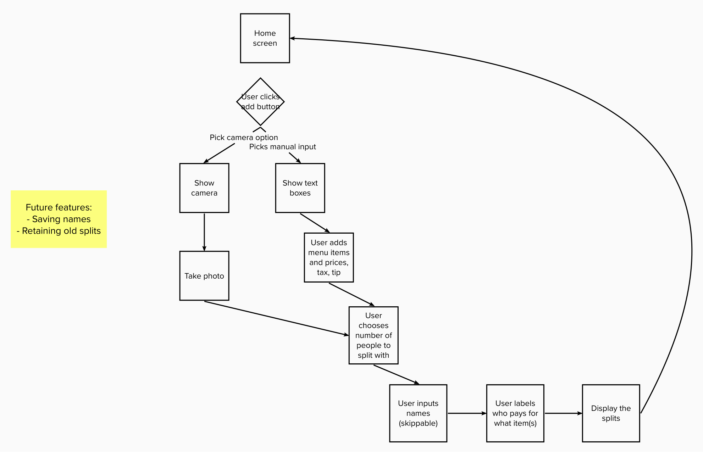
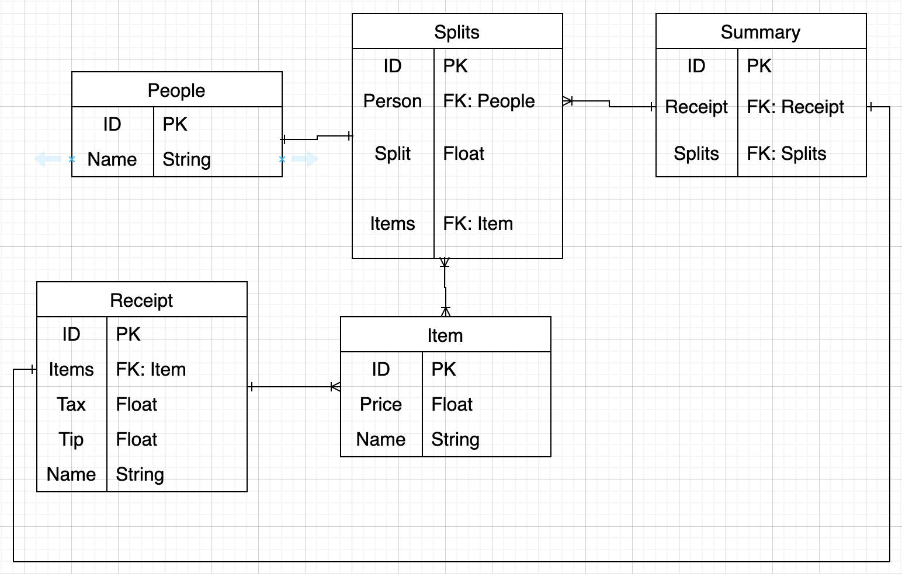

# Split Check

### By: [Justin Trieu](https://www.linkedin.com/in/justin-trieu/) & [Canh Vo](https://www.linkedin.com/in/canhvo16/)

## **_Overview_**

Split check is a Full Stack mobile application built with a React Native frontend and Firebase backend. Users will be able to input a bill and split it amongst their party members.

## **_User Flow_**

https://app.mural.co/invitation/mural/checksplit0018/1674662321180?sender=u8ff0a3d7498c918751e83641&key=9e2adabc-1aba-402e-80cb-815a6396110a

## **_Entity Relational Diagram (ERD)_**

## **_Future Plans_**

- Allow users to take a photo of receipt to extract data

## **Tech Stack**
- React Native
- Node.js v16.0.0
